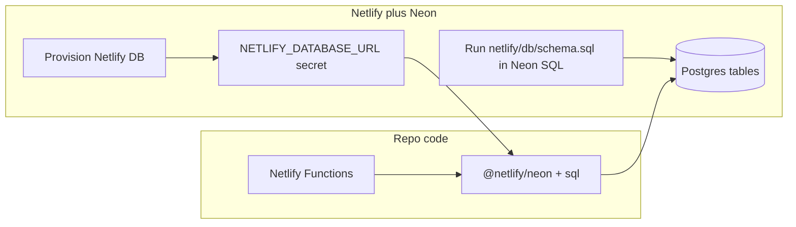

# Netlify DB: what was done vs what you still need

## Security notice (important)

A **full Postgres connection string (with password) must never** be pasted into the codebase, README, tickets, or assistant chat. Treat it as compromised: **rotate the database password in the Neon console**, then set the new value only in **Netlify → Environment variables → `NETLIFY_DATABASE_URL`** (and optionally in a **local `.env.local`** that is gitignored). The app’s functions read `**NETLIFY_DATABASE_URL**` only at runtime; nothing in this repo should contain the password.

This workspace **cannot** safely “take” a pasted URL and manage your remote database on your behalf. **You** manage it via the **Neon console** (SQL, branches, reset password) and Netlify’s **env vars**. The agent can only help with **DDL in-repo** (`[netlify/db/schema.sql](netlify/db/schema.sql)`) and code—**not** storing or replaying live secrets.

## What the migration actually changed (in this repo)

Per `[.cursor/plans/netlify_db_full_migration_30576733.plan.md](.cursor/plans/netlify_db_full_migration_30576733.plan.md)`, the work was **code-only**:

- **Removed** Supabase (`@supabase/supabase-js`, `netlify/functions/lib/supabase.ts`).
- **Added** `[@netlify/neon](https://docs.netlify.com/netlify-db/)` and a shared client in `[netlify/functions/lib/db.ts](netlify/functions/lib/db.ts)` (uses `**NETLIFY_DATABASE_URL`**).
- **Rewrote** all DB-using Netlify functions to raw SQL (`identity-signup`, meal/attendance/host flows, `lib/auth.ts`).
- **Added** `[netlify/db/schema.sql](netlify/db/schema.sql)` to run **once** in Neon.

**Provisioning** Netlify DB (now done) should create the Neon project and usually inject `**NETLIFY_DATABASE_URL`** on the site. **Creating tables** is still a separate step: run `**netlify/db/schema.sql`** in Neon’s SQL editor.

## Where to “see” the database in Netlify

- **Site → Environment variables:** `NETLIFY_DATABASE_URL` (value is secret; use “reveal” only when needed).
- **Extensions → Neon:** open Neon dashboard / SQL editor for the linked project.
- Unclaimed databases can expire per [Netlify DB — claim your database](https://docs.netlify.com/netlify-db/).

## Two different “sign up” flows

| What users see                    | What it uses                                                                                                  | Uses Netlify DB?                            |
| --------------------------------- | ------------------------------------------------------------------------------------------------------------- | ------------------------------------------- |
| Request an invitation (marketing) | `[components/ui/InviteForm.tsx](components/ui/InviteForm.tsx)` → Web3Forms; needs `NEXT_PUBLIC_WEB3FORMS_KEY` | No                                          |
| Accept invite / member account    | Netlify Identity → `[netlify/functions/identity-signup.ts](netlify/functions/identity-signup.ts)`             | Yes — needs `NETLIFY_DATABASE_URL` + schema |

## Checklist after provisioning

1. **Rotate Neon password** (because a connection string was shared); in Neon, regenerate/reset password, then update `**NETLIFY_DATABASE_URL`** in Netlify to the new connection string Neon shows.
2. **Confirm** `NETLIFY_DATABASE_URL` is set for Production (and previews if needed).
3. **Run** `[netlify/db/schema.sql](netlify/db/schema.sql)` in Neon SQL editor once.
4. **Claim** Neon if you need the DB long-term.
5. **Redeploy** the site so functions pick up env changes.
6. If **Identity signup** still fails: Netlify → Functions → `identity-signup` → Logs (look for missing env vs missing relation `users`).

## Optional follow-up

- README note: never commit `.env.local` with `NETLIFY_DATABASE_URL`.
- Optional `SELECT 1` health function behind a secret (out of scope unless you ask to implement).

