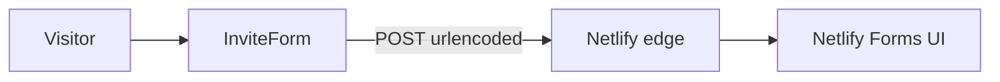

# Connect the enrollment form to Netlify Forms

## Context

- [InviteForm.tsx](components/ui/InviteForm.tsx) is a client component that **POSTs JSON** to `api.web3forms.com` using `NEXT_PUBLIC_WEB3FORMS_KEY`.
- The site uses **static export** (`output: "export"` in [next.config.mjs](next.config.mjs)), so the built site is the `**out/`** folder—this is what Netlify should publish.
- Netlify Forms **does not** use Web3Forms or JSON bodies. It registers forms found in the **deployed HTML** and accepts submissions as `**application/x-www-form-urlencoded`** to your site (or a documented AJAX pattern with the same encoding).

---

## 1. Netlify project settings (dashboard)

1. **Link the repo** (if not already): GitHub → Netlify → import site → same repo you use locally.
2. **Build settings** (must match Next static export):
  - **Build command:** `npm run build` (or `pnpm` / `yarn` if you use those—match [package.json](package.json)).
  - **Publish directory:** `out`.
3. Optionally add a root **[netlify.toml](netlify.toml)** in the repo so settings are versioned and repeatable (see step 5).

After the first deploy **with** the updated form markup, open **Site configuration → Forms** and confirm Netlify lists your form (e.g. `invite-request`). If it does not appear, the HTML form was not present in the build output (see troubleshooting in step 6).

---

## 2. Code changes: make the form “Netlify-native”

All in [components/ui/InviteForm.tsx](components/ui/InviteForm.tsx) (and optionally small related tweaks).

**Form element**

- Add a stable `**name`** for the form, e.g. `name="invite-request"`.
- Add `**method="POST"`** (Netlify expects POST).
- Add `**data-netlify="true"**` (Netlify’s hook to register the form at build time).
- Optional: `**data-netlify-honeypot="bot-field"**` (or another field name) for basic spam protection; add a matching hidden/visually hidden input Netlify documents for that attribute.

**Hidden fields**

- Add a hidden input: `**name="form-name"`** with `**value` equal to the form’s `name`** (e.g. `invite-request`). This is required for Netlify to associate submissions with the correct form when using programmatic or AJAX submit.

**Field names**

- Keep `name` attributes on inputs Netlify can read. `react-hook-form`’s `register("name")` etc. already outputs `name="name"`, `name="email"`, …—keep those consistent so submissions show clear column names in the dashboard.

**Submit handler (replace Web3Forms)**

- Remove the dependency on `**NEXT_PUBLIC_WEB3FORMS_KEY`** and the `fetch` to `api.web3forms.com`.
- On valid submit, `**fetch`** the **current site path** (e.g. `"/"` or `window.location.pathname` if you deploy under a subpath) with:
  - `**method: "POST"`**
  - `**headers: { "Content-Type": "application/x-www-form-urlencoded" }`**
  - `**body**`: URL-encoded string including at least `**form-name**`, `**name**`, `**email**`, `**referredBy**`, `**why**`, and any honeypot field if used. Use `URLSearchParams` (or equivalent) to build the body from your form values.
- Treat `**response.ok**` as success (Netlify returns an HTML page body, not JSON—do not `res.json()`).
- Keep your existing UX: loading state, success message, `reset()`, and error handling on network failure.

**Why not a plain browser navigation?** A full HTML form POST would work but typically navigates away or reloads; the encoded `fetch` approach preserves your current SPA-style success UI without a full page reload.

---

## 3. Environment and docs cleanup

- Update [.env.local.example](.env.local.example): remove `**NEXT_PUBLIC_WEB3FORMS_KEY`** (or comment that Netlify Forms is used instead).
- Update [README.md](README.md) enrollment section: describe Netlify Forms and link to **Site → Forms** for submissions; remove Web3Forms-only instructions.
- Delete or ignore `**NEXT_PUBLIC_WEB3FORMS_KEY`** in any Netlify **environment variables** (not needed for this form once migrated).

---

## 4. Netlify dashboard after deploy

1. **Forms** tab: verify submissions appear for `invite-request` (or whatever you named the form).
2. **Notifications** (optional): email notifications when a form is submitted.
3. **Spam / honeypot**: if you enabled honeypot, confirm behavior in Netlify’s docs and test that real users are not blocked.

---

## 5. Optional: `netlify.toml` in repo

Add a minimal [netlify.toml](netlify.toml) at the repo root:

- `[build]` → `command = "npm run build"` and `publish = "out"` (adjust if your package manager differs).

This documents the deploy and avoids mis-set publish directory in the UI.

---

## 6. Troubleshooting (if the form does not register)

- **Deploy log:** Netlify often logs when it detects forms.
- **Build output:** Confirm the built `**out/`** HTML for the home page (or the page that contains the form) includes `**data-netlify="true"`** and the `**form-name**` hidden input in the initial HTML—not only after client-only hydration. Next.js static export generally renders client components into the initial HTML for the default state; if your form only mounts after client-only logic, you may need a small **static duplicate** form (hidden) for detection only—Netlify documents this pattern for edge cases.

---

## 7. Local testing limitation

- Netlify Forms **submission handling** does not run on `netlify dev` or plain `next dev` the same way as production in all cases. Rely on a **deploy preview** or production deploy to test end-to-end; locally you can still verify the `fetch` runs and the payload shape is correct.

---

## Summary checklist

| Step       | Action                                                                       |
| ---------- | ---------------------------------------------------------------------------- |
| Netlify UI | Build `npm run build`, publish `out`                                         |
| Code       | Form `name`, `method`, `data-netlify`, hidden `form-name`, optional honeypot |
| Code       | Replace Web3Forms `fetch` with urlencoded POST to site path                  |
| Repo       | `netlify.toml` (optional), README + `.env.local.example`                     |
| Netlify    | Confirm form appears under Forms; set notifications                          |

