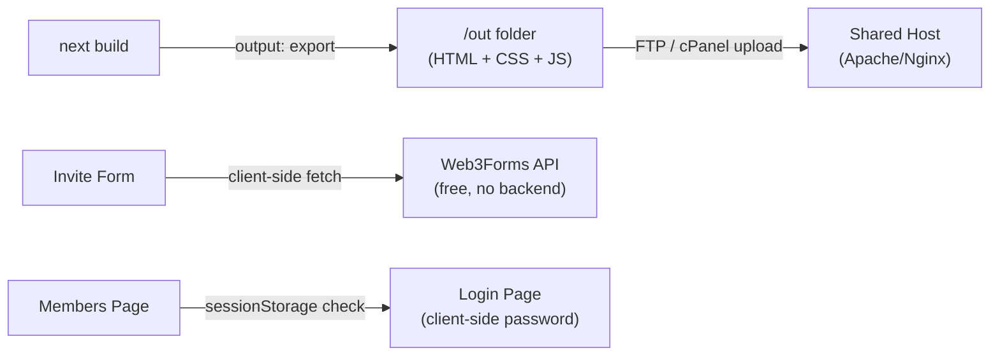

# SDSupperClub Website

## Hosting Model: Static Export → Shared Host

The site builds to a plain `/out` folder via `next build` (with `output: 'export'`). You upload the contents of `/out` to your host via FTP, cPanel File Manager, or any drag-and-drop file uploader — no Node.js server required.



## Tech Stack

- **Next.js 14** (App Router, TypeScript, `output: 'export'`)
- **Tailwind CSS v3** with custom design tokens
- **Framer Motion** — cinematic transitions (700–1000ms)
- **Fonts via next/font**: `Cormorant_Garamond` (headlines) + `Geist` (body, Söhne-equivalent)
- **Sanity.io** — schemas scaffolded, `@sanity/client` configured, mock data used until CMS is connected
- **React Hook Form** — invitation request form
- **Web3Forms** — free client-side form submission service (replaces Resend; no backend needed)
- **Client-side auth** — members page password stored in `NEXT_PUBLIC_MEMBERS_PASSWORD` env var, session tracked in `sessionStorage`

> No API routes, no middleware, no server runtime — fully compatible with traditional shared hosting.

## File Structure

```
app/
  layout.tsx              # Root layout: fonts, cursor, nav
  page.tsx                # All public sections assembled
  members/
    page.tsx              # Client-side guarded member dashboard
  login/
    page.tsx              # Password login UI (client-side only)
components/
  cursor/CustomCursor.tsx
  nav/Navigation.tsx
  sections/
    Hero.tsx
    WhatItIs.tsx
    Experience.tsx
    PastDinners.tsx
    Membership.tsx
    UpcomingDinner.tsx
    ContactFooter.tsx
  ui/
    Button.tsx
    InviteForm.tsx        # Web3Forms-powered, React Hook Form
    FadeIn.tsx            # Reusable Framer Motion wrapper
lib/
  sanity.ts               # @sanity/client config (future CMS hookup)
  mock-data.ts            # All placeholder content
sanity/
  schemas/
    dinner.ts
    chef.ts
    upcomingDinner.ts
  config.ts
public/images/            # Placeholder image slots
next.config.ts            # output: 'export', trailingSlash: true
tailwind.config.ts
.env.local.example
README.md
```

## Color & Typography Tokens (tailwind.config.ts)

- `charcoal`: `#0D0B09` — deep warm black
- `parchment`: `#F5F0E8` — warm ivory base
- `brass`: `#B8935A` — primary accent
- `terracotta`: `#C4674A`
- `fig`: `#4A2E35`
- Font families: `var(--font-cormorant)` / `var(--font-geist)`

## Key Design Decisions

- **Dark mode default** (`charcoal` bg, `parchment` text) — matches the candlelit aesthetic; light mode via CSS class toggle
- **Navigation**: `fixed`, transparent until scroll >80px, then adds subtle `backdrop-blur` + charcoal tint. Logo left, links center, "Request Invite" CTA right (ghost button)
- **Custom cursor**: 8px dot + 32px expanding ring, `mix-blend-mode: difference`
- **Animations**: all via a `<FadeIn>` wrapper using `framer-motion` viewport detection, 0.8s ease
- **Past Dinners grid**: asymmetric masonry-style layout, each card shows date, neighborhood, chef, one-line menu, 1–2 images
- **Invite Form**: React Hook Form + Web3Forms — name, email, referred by, why you'd love to come. Submits via client-side `fetch` to `https://api.web3forms.com/submit`; you configure your notification email inside the Web3Forms dashboard using a free access key
- **Members page**: client-side only — on load checks `sessionStorage` for `sdsc_auth`. If missing, redirects to `/login`. Login page checks the typed password against `process.env.NEXT_PUBLIC_MEMBERS_PASSWORD` (baked in at build time). Not cryptographically hardened, but appropriate for this use case

## Placeholder Copy Highlights

- Hero: *"Ten seats. One chef. Someone's home. Once a month."*
- WhatItIs: *"SDSupperClub is a monthly dinner for ten people who love a good meal and even better company. Held in a member's San Diego home. Cooked by a chef who cares."*
- Experience: *"The kind of evening that starts at 7 and ends at midnight without anyone noticing. There's no menu card — just whatever the chef felt moved to cook that week. The wine gets opened early. Strangers become people you'll text next weekend."*
- Past Dinners mock entries: 4 entries spanning Oct 2024–Feb 2025 with neighborhoods (North Park, Ocean Beach, South Park, Bankers Hill), chef names, one-line menus
- Upcoming: March 2025 — Mission Hills — Chef name TBD

## Environment Variables (`.env.local.example`)

```
# Sanity CMS (leave blank to use mock data)
NEXT_PUBLIC_SANITY_PROJECT_ID=your_project_id
NEXT_PUBLIC_SANITY_DATASET=production

# Web3Forms (get a free access key at web3forms.com)
NEXT_PUBLIC_WEB3FORMS_KEY=your_access_key

# Members page password (baked into static build — keep simple)
NEXT_PUBLIC_MEMBERS_PASSWORD=your_password_here
```

## Deploying to Shared Hosting

1. Run `npm run build` — this produces an `/out` folder
2. Upload the entire contents of `/out` to your host's `public_html` (or `www`) folder via FTP or cPanel
3. No server config needed — Apache/Nginx serves the static files as-is
4. If your host requires it, enable `trailingSlash: true` in `next.config.ts` (already set) so `/members/` resolves correctly
