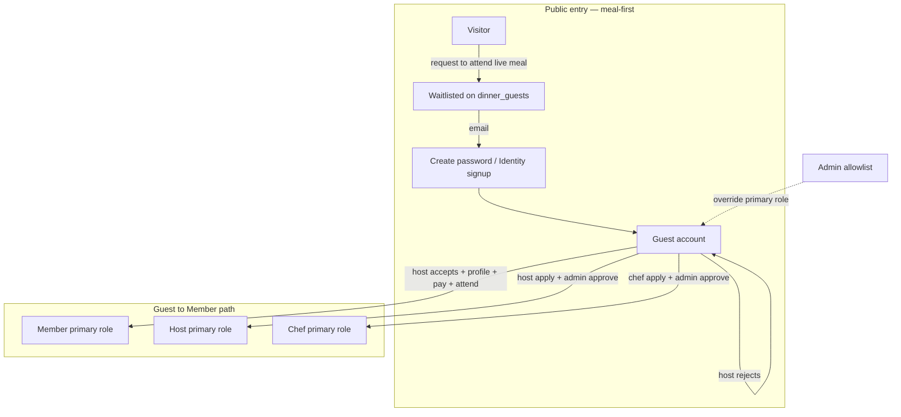
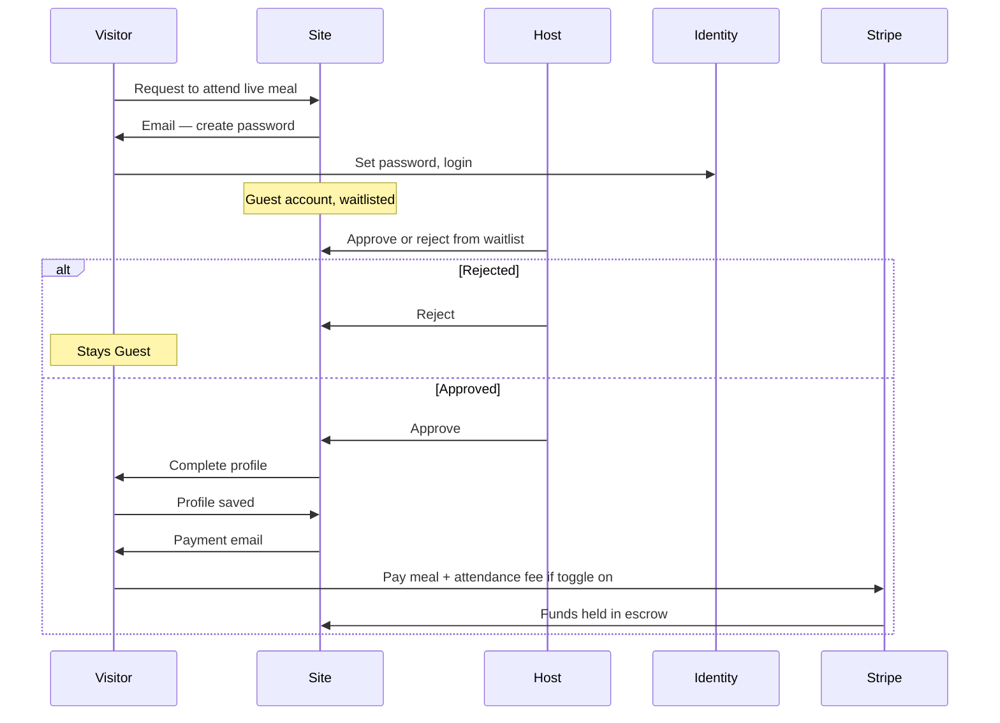
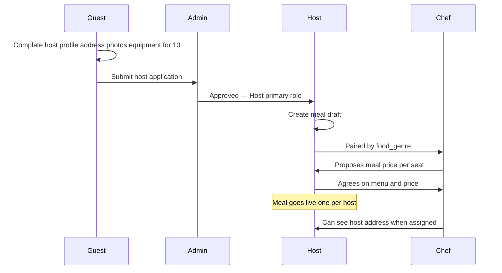
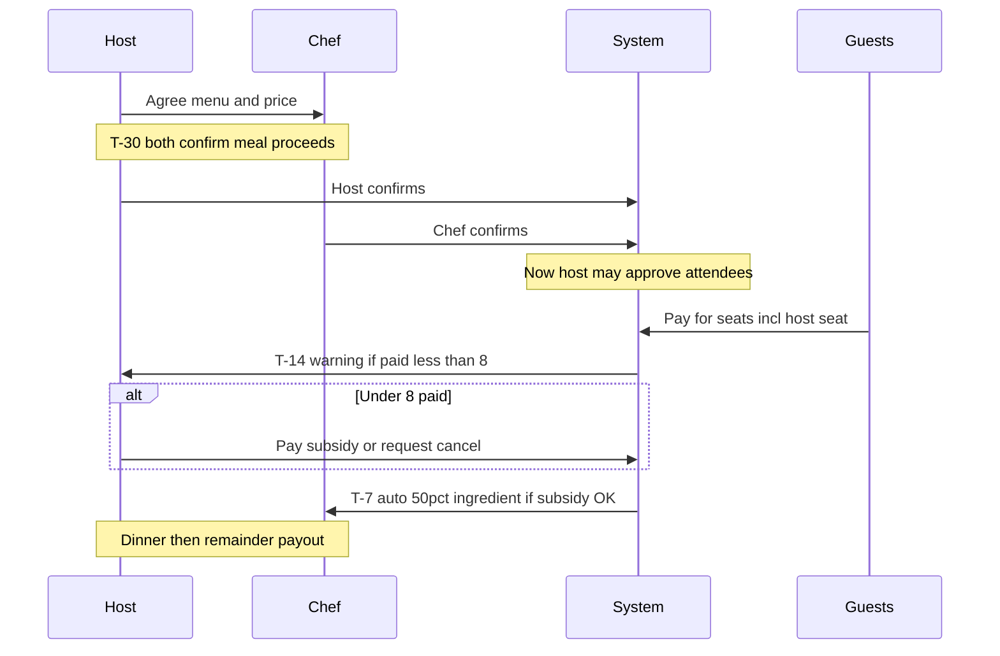
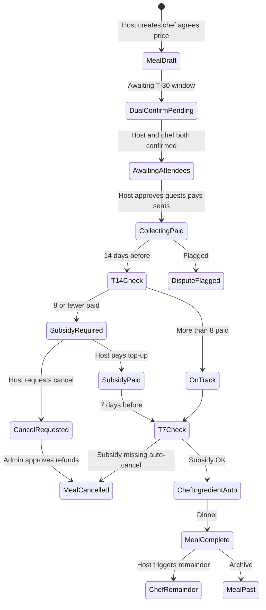
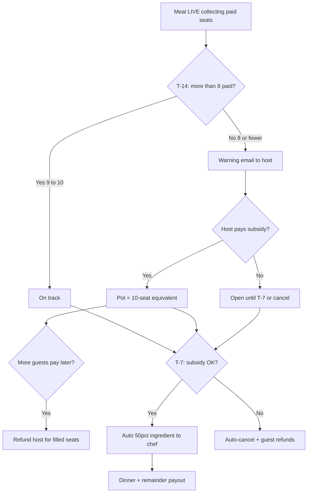

# Actor Model, Flows, and UI Plan

> **Status:** Phases 1–4 implemented (2026-06-08) — meal-first onboarding, role workspaces, meal lifecycle, payment stubs, ops cron + admin tabs
> **Last updated:** 2026-06-08  
> **Miro board:** [Supper Collective flows](https://miro.com/app/board/uXjVHI1dVnI=/)  
> **Related:** [`docs/sitemap.md`](sitemap.md), [`netlify/db/schema.sql`](../netlify/db/schema.sql)

Use this document as the single source of truth for actor roles, meal lifecycle, payments, and UI organization. **Q&A complete** — all edge cases and general decisions locked (2026-06-08).

---

## Table of contents

1. [Terminology](#terminology)
2. [Locked decisions (Q&A complete)](#locked-decisions-qa-complete)
3. [Identity model](#identity-model)
4. [Actor capability matrix](#actor-capability-matrix)
5. [End-to-end flows](#end-to-end-flows)
6. [Attendee status model](#attendee-status-model-dinner_guests)
7. [UI organization by actor](#ui-organization-by-actor)
8. [Gap analysis vs current code](#gap-analysis-vs-current-code)
9. [Schema additions needed](#schema-additions-needed)
10. [Implementation phasing](#implementation-phasing)
11. [Key files to change](#key-files-to-change)
12. [Q&A Round 3 — decisions](#qa-round-3--decisions-locked-2026-06-08)
13. [Miro visualization](#miro-visualization)
14. [Implementation checklist](#implementation-checklist)

---

## Terminology

| Term | Meaning |
|------|---------|
| **Guest** | Default **primary role** for new accounts (previously called "Member"). Unverified until first attended meal flow completes. |
| **Member** | **Primary role** after verification: host accepted + profile complete + paid + **attended first meal** (previously called "Guest"). |
| **`members` table** | Internal DB table name (unchanged) — stores all app users regardless of primary role. |
| **`dinner_guests` table** | Seat/RSVP row for a specific dinner — not the same as the Guest primary role. Prefer **attendee** in UI copy where ambiguous. |

**Primary role enum:** `guest` | `member` | `host` | `chef` (one primary role; admin can override)

---

## Locked decisions (Q&A complete)

| Topic | Decision |
|-------|----------|
| **Guest vs Member** | Everyone starts as **Guest**. They become **Member** only after: host accepted them for a meal + completed profile + paid + **physically attended** that meal. Rejected meal applicants stay Guests. |
| **Onboarding** | Public **request to join** form (no meal commitment) → admin reviews → Identity invite / create password. **Request a seat** is post-login only (guest/member home). Public calendar shows a redacted nearest meal (date + ZIP) to tempt join/login. |
| **RSVP flow** | Auto-**waitlisted** on request → host approves/rejects from list → on approve: login + complete profile → payment email. Request stays active until meal is **full (10 seats)** or host rejects. |
| **Attendee cancel** | **Full refund only if 14+ days before dinner**. **No refund if cancelling with less than 2 weeks notice.** Before pay: cancel freely while pending. |
| **Host cancel (general)** | Host requests cancel → admin approves → **full refund** to all paid attendees (unless late-cancel rules below apply to host penalties only). |
| **Payments (interim)** | **Platform Stripe Checkout** — guest (and subsidy) charges land in the platform Stripe account. `payments` / `payouts` are **ops ledger rows**, not Connect transfers or real escrow. Demo fulfillment only with `ALLOW_DEMO_PAYMENTS=true` outside production. |
| **Payments (future)** | Stripe Connect + destination charges / escrow when ready to split chef/host payouts automatically. |
| **Attendance fee** | **Global on/off toggle** (admin only) — can be disabled early as platform gains traction. When on, charged on top of meal cost. |
| **Concurrent meals** | **One live dinner per approved host**; multiple hosts = multiple simultaneous live dinners. |
| **Chef onboarding** | Separate **`/chef/apply`** route: CV + past references → admin approves. |
| **Role composition** | **One primary role per person** (Guest, Member, Host, or Chef); admin can override. |
| **Disputes** | Host **or** chef can **flag a meal** → pauses all payouts → notifies admin → admin resolves off-platform → admin triggers payments/refunds in app. |
| **Meal pricing** | **Chef inputs** per-guest meal cost; **host must agree** before meal goes live. |
| **Host application** | Applicant completes **full host profile first** (address, phone, allergies, kitchen/dining photos) + **confirm cutlery, glassware, crockery for 10** — then **submits for admin approval**. Admin reviews complete application before approve/reject. |
| **T−30 days (1 month before meal)** | **Host AND chef must both independently confirm** the meal goes forward. Must occur **before any attendees are confirmed** (no guest approvals/confirmations until dual confirm complete). |
| **Fill threshold** | **80% = 8 paid seats** minimum; **warning at ≤8** at T−14; **on track at 9–10** without deficit warning. |
| **T−14 days** | If **≤ 8 paid** (including exactly 8): **warning email** — host may continue only by **subsidizing shortfall via platform**. If host **won't** subsidize: **host requests cancel → admin approves**. |
| **Host subsidy** | Host pays unfilled seats so pot = **10-person equivalent**. If **2+ additional guests pay later**, host **refunded** for those seat-equivalents. **Interim:** one-shot Checkout / demo subsidy payment (no saved card). **Future:** host card on file. |
| **T−7 days** | If subsidy satisfied (8+ paid OR host top-up): **automatic** chef **ingredient payment** = **~50% of full 10-person pot**. If subsidy **not** satisfied: **auto-cancel** + guest refunds. |
| **Late host cancel (after T−7 ingredient paid)** | **Guests still get full refunds.** Host **loses own seat cost** and must **cover remaining ingredient costs** already paid to chef. **Chef keeps** ingredient payment. **Interim:** admin resolves charges off-platform / manually. **Future:** charge card on file. |
| **Post-meal chef pay** | Host triggers **remainder** after meal unless dispute flagged. |
| **Seat payment** | **Everyone pays for a seat**, including **host** (counts toward 10). **Interim:** Checkout per seat. **Future:** host keeps card on file for subsidy and late-cancel charges. |
| **T−14 at exactly 8 paid** | Send **warning email anyway** — “at minimum; consider subsidizing to reach 10.” |
| **Public listing before T−30** | Meal is **hidden from public catalog** until **T−30 dual confirm** succeeds (host + chef both confirm). No public discoverability or seat requests before then. |
| **Guest cancel after host subsidy** | **No automated rule** — if a paying guest cancels (14+ days) after host subsidized, **defer to admin** to resolve subsidy adjustment manually. |
| **Dispute after T−7 ingredient paid** | **No automated hold/reverse** — admin resolves case-by-case (chef keeps, partial clawback, or reversal); **remainder payout paused** until resolved. |
| **Attendance fee on cancel** | **T−7 auto-cancel:** full refund of seat + attendance fee. **Late host cancel:** stricter policy — guests refunded per late-cancel rules; attendance fee not automatically waived (admin applies late-cancel policy). |
| **Fee waiver (v1)** | **Global toggle only** — no per-guest attendance fee waivers in v1. |
| **Chef pairing** | **Auto-pair by food_genre** for v1; add **host picker** from approved chefs when pool scales. |
| **Guest → host application** | **Yes** — any Guest may apply to host **without attending a meal first**. |
| **Host/Member RSVP elsewhere** | **No while hosting** — Host cannot request a seat at another host's meal while they have an **active live meal**. Members may still RSVP at other meals. |

---

## Identity model

One Netlify Identity login. **Primary role** drives default nav and permissions; admin is a separate allowlist overlay.

**Guest** (default): browse live meals, request to attend, see request status, complete profile when host accepts, pay when approved.

**Member** (after first attended meal): Guest capabilities plus verified status, past-meals history, Member-profile emphasis in UI.

**Host / Chef:** separate application flows; once approved, primary role switches (admin can override).

---

## Actor capability matrix

| Actor | Sees | Can do |
|-------|------|--------|
| **Admin** | All dinners (grouped by lifecycle), all users, financial pots per meal, pending host + chef + meal-cancel requests, flagged disputes | Approve/reject host applications (full profile + equipment for 10); approve/reject chef applications; approve/reject meal cancellations; toggle attendance fee; resolve disputes; trigger payments/refunds |
| **Guest** | Public site; live meals; own pending meal request(s) | Request to attend; create password; complete profile after host accepts; pay when approved; cancel pending freely; cancel paid seat (**refund only if 14+ days before meal**); apply to become host |
| **Member** | Guest views + past meals attended; Member profile | Edit profile; view/cancel upcoming attendance (**14-day refund rule**); request seats at new meals |
| **Host** | Host profile; attendee waitlist (after T−30 dual confirm + public listing); fill dashboard; subsidy status | Create meal; **dual confirm with chef at T−30** → meal goes public; then approve attendees; pay own seat; T−14 subsidy; request cancel; card on file for penalties; **cannot RSVP at other meals while hosting a live meal** |
| **Chef** | Assigned meals; dual-confirm status; T−7 / remainder payout schedule | Agree on price; **confirm meal at T−30** with host; automatic ingredient pay at T−7; flag dispute |

**Platform revenue:** attendance fee (global toggle) on top of meal cost when toggle is on.

---

## End-to-end flows

### A. New user → first meal (replaces club invite)

Request remains active until **10 paid/confirmed seats** or **host rejects**.

### B. Host + chef → live meal

### C. Meal timeline — dual confirm, fill milestones, payouts

Chronological order relative to **`display_date`**:

| When | Rule |
|------|------|
| **After price agreed** | Meal in **draft/unlisted** state — **not on public catalog** until T−30 dual confirm |
| **T−30** | **Host + chef both confirm** meal proceeds → meal **goes public** |
| **After T−30 dual confirm** | Host approves attendees; all parties **pay for seats** |
| **T−14** | If **<8 paid**: warning + subsidy option; else on track |
| **T−14 decline subsidy** | Host **requests cancel** → admin approves → guest refunds |
| **Before T−7** | Extra paid guests → **partial subsidy refund** to host |
| **T−7** | Auto **50% ingredient** to chef if subsidy OK; else **auto-cancel** |
| **Late host cancel** | Guests **fully refunded**; host charged own seat + chef ingredient gap |
| **Attendee cancel** | Refund only if **≥14 days** before meal |

**Supersedes:** Manual "chef requests ingredient payout after host confirms proceeding" — ingredient is **automatic at T−7**. Host+chef **dual confirm at T−30** replaces old single "host confirm proceeding" step.

### D. Meal operations → payouts (state machine)

**Email touchpoints:** create-password; payment request; **T−14 fill warning + subsidy CTA**; **T−7 chef ingredient confirmation**; host subsidy refund when seats fill; post-meal remainder invite; admin notifications; dispute/cancel emails.

---

## Attendee status model (`dinner_guests`)

| Status | Meaning | Who acts next |
|--------|---------|---------------|
| `waitlisted` | Requested seat; awaiting host | Host approve/reject |
| `approved` | Host accepted; profile + payment needed | Guest completes profile, pays |
| `paid` | Paid; funds in Stripe escrow | Attend meal (after host confirms proceeding) |
| `confirmed` | Seat locked for dinner | Attend meal |
| `attended` | Showed up | Promote to **Member** primary role; payout flows |
| `rejected` | Host declined | — |
| `cancelled` | Cancelled or refunded | — |

---

## UI organization by actor

Current routes: [`/app/page.tsx`](../app/page.tsx), [`/login/`](../app/login/page.tsx), [`/members/`](../app/members/page.tsx) (rename/refactor in Phase 1), [`/admin/`](../app/admin/page.tsx).

### Public site — `/`

- **Remove** `#request-invite` club invite form; replace with **request to attend** on each live meal card.
- Show **live** dinners only after **T−30 dual confirm** (host + chef agreed + both confirmed); one card per host.
- Past menus unchanged.

### Shared authenticated shell

- Nav driven by **primary role**: **Guest home** | **Member home** | Host workspace | Chef workspace.
- Admin link when on allowlist.
- Admin can override primary role assignment.

### Guest home — `/guest/` (evolve from `/members/`)

1. **Live meals** — request to attend; show waitlist status.
2. **Profile wizard** — unlocked after host accepts (before payment): name, email, zip, phone, allergies.
3. **Payment** — Stripe checkout when approved + profile complete.
4. **Apply to host** — **complete host profile first** (address, phone, allergies, kitchen/dining photos, cutlery/glassware/crockery for 10), then submit for admin approval.

### Member home — `/member/`

Same as Guest plus:

- **Past meals** attended.
- Prominent profile edit.
- Cancel with **14-day refund** messaging when paid.
- Verified Member badge / labeling in UI.

### Host workspace — `/host/`

1. **Host profile** — editable after approval; same fields as application.
2. **My meal** — single active draft/live meal; menu, drink pairing, food genre; agree to chef-proposed price.
3. **Attendee waitlist** — approve/reject; see allergies; seat count toward 10.
4. **Chef pairing** — agree on menu and price.
5. **Meal ops** — fill-rate tracker (paid/10); T−14 subsidy flow; request cancellation; post-meal remainder; dispute flag.

### Chef workspace — `/chef/` + `/chef/apply`

**Apply:** CV, references, contact info → admin approves.

**Dashboard:** profile, meals, payouts, dispute flag.

### Admin dashboard — `/admin/`

1. **Host applications** — review **complete profile** + cutlery/glassware/crockery confirmations before approve/reject.
2. **Chef applications** — CV, references, approve/reject.
3. **Meals** — grouped by lifecycle (draft, live, full, confirmed, dispute, cancel requested, past).
4. **Funds** — pots, escrow, attendance fee toggle, payout triggers.
5. **Disputes** — flagged meals; resolve + trigger payment/refund.
6. **Users** — all Guests/Members/hosts/chefs; primary role override.

---

## Gap analysis vs current code

Schema: [`netlify/db/schema.sql`](../netlify/db/schema.sql). Sitemap: [`docs/sitemap.md`](sitemap.md).

### Implemented today (partial fit)

| Area | Status |
|------|--------|
| Identity login + `members` row | Done — needs meal-first trigger; rename UI labels Guest/Member |
| Admin invitation approve/reject UI | Restored — New Guests tab for join-without-meal applications |
| Guest requests seat on one live dinner | Done — public `MealRequestForm` + host approve step |
| Host request form | Done — profile + equipment before admin submit |
| Payments | Interim platform Checkout + opt-in demo — **not** Stripe Connect yet |

### Major mismatches to resolve

| Requirement | Current state |
|-------------|---------------|
| Meal-first onboarding | Reverted for public entry (Jul 2026): club join form + admin gate; seat request post-login |
| Guest → Member after attend + profile + pay | Done via `host-mark-attended` + profile + paid path |
| Host profile before admin approval | Done |
| Host approves before payment | Done |
| One live meal per host | Done |
| Chef apply + admin approve | Done |
| Primary role per user | Done |
| Stripe Connect + split payouts | **Future** — interim is platform Checkout + ops `payouts` |
| T−30 dual confirm | Not implemented |
| T−14 / T−7 milestone jobs | Not implemented |

---

## Schema additions needed

- **`members`:** `primary_role` (`guest` | `member` | `host` | `chef`); `zip`; profile completion flag.
- **`hosts`:** kitchen/dining photo URLs; `cutlery`, `glassware`, `crockery` (all `true` at submit); collect full profile **before** `approval_status = pending`.
- **`chefs`:** bio, headshot, CV, references, Stripe Connect id, `approval_status`.
- **`dinners`:** `display_date`; `meal_price_per_guest`; fill-milestone flags (`t14_warning_sent`, `t7_ingredient_paid`); `subsidy_required`, `subsidy_paid_amount`; expanded status (`subsidy_pending`, `cancel_pending_fill`, etc.).
- **`dinner_guests`:** include **host seat** row; status + refund timestamps.
- **`payments` / `payouts`:** guest seat charges; **host_subsidy** charges + partial refunds; **chef_ingredient_auto** at T−7; **chef_remainder** post-meal; escrow release rules.
- **Scheduled jobs:** daily cron (or date-triggered functions) for T−14 check, T−7 ingredient payout, T−7 auto-cancel if subsidy missing.

---

## Implementation phasing

### Phase 1 — Onboarding & roles (no Stripe yet)

Meal-first signup; **Guest/Member** primary roles and UI labels; host apply = **full profile + equipment → submit → admin approve**; attendee approve/reject by host; chef admin approval; remove legacy invite admin tab.

### Phase 2 — Meal lifecycle

Host meal CRUD; chef pairing/agreement; public live meals; promote **Guest → Member** after first attendance.

### Phase 3 — Platform Checkout (interim); Connect later

**Current (shipped):** platform Stripe Checkout for guest seats + host subsidy when `STRIPE_SECRET_KEY` is set; fail-closed without it unless `ALLOW_DEMO_PAYMENTS=true` (non-production); attendance fee toggle; T−14 / T−7 cron bookkeeping via `payments` / `payouts` ops rows.

**Not yet (Connect):** destination charges, real escrow hold/release, saved cards, automatic chef Connect payouts.

### Phase 4 — Ops

Disputes; **auto-cancel at T−7**; cancellation edge-case resolution; milestone emails; archival.

---

## Key files to change

| File | Change |
|------|--------|
| [`netlify/db/schema.sql`](../netlify/db/schema.sql) | Schema additions above |
| [`components/ui/MealRequestForm.tsx`](../components/ui/MealRequestForm.tsx) | Meal-first public seat request (replaces InviteForm) |
| [`app/members/page.tsx`](../app/members/page.tsx) | Refactor → Guest/Member role-aware UI |
| [`netlify/functions/request-host.ts`](../netlify/functions/request-host.ts) | Require full profile + equipment before pending |
| `app/host/`, `app/chef/`, `app/guest/`, `app/member/` | New role workspaces |
| [`docs/sitemap.md`](sitemap.md) | Update routes |
| [`docs/actors.md`](actors.md) | This document — update as decisions land |

---

## Q&A Round 3 — decisions (locked 2026-06-08)

### Edge cases

| ID | Decision |
|----|----------|
| **EC1** | **Admin resolution** — no automated subsidy refund when guest cancels after host subsidized; admin resolves manually if it occurs. |
| **EC2** | **B** — Send warning email at exactly 8 paid (“at minimum; consider subsidizing to 10”). |
| **EC3** | **Admin resolution** — no automated hold/reverse of ingredient payment; admin decides case-by-case; remainder payout paused. |
| **EC4** | **B** — Meal **hidden from public catalog** until T−30 dual confirm succeeds. |
| **EC5** | **D** — **Auto-cancel:** full refund of seat + attendance fee. **Late host cancel:** stricter policy (attendance fee not automatically waived). |

### General

| ID | Decision |
|----|----------|
| **G1** | **Global toggle only** — no per-guest fee waivers in v1. |
| **G2** | **Auto-pair for v1**; add host picker from approved chefs when pool scales. |
| **G3** | **Yes** — Guest may apply to host without attending first. |
| **G4** | **No while hosting** — Host cannot RSVP at another meal while they have an active live meal. Members may. |

---

## Miro visualization

**Board:** [Supper Collective flows](https://miro.com/app/board/uXjVHI1dVnI=/)

**Status:** Updated diagrams **(updated)** live on board at y ≈ 4500 (diagrams 1–5) and y ≈ 8200 (diagram 6). Reference doc updated on board. Older top-row diagrams without "(updated)" in the title can be deleted.

**Pending:** Diagram 7 — fill milestones (T−14 warning, host subsidy, T−7 chef ingredient auto-pay, cancellation branches).

---

## Implementation checklist

Use this as a high-level progress tracker. Do not start coding until edge cases (or explicit overrides) are decided and you say **execute the plan**.

- [x] **Q&A Round 3** — EC1–EC5 + G1–G4 answered (2026-06-08)
- [x] **Miro** — Diagram 7 spec in [`miro-diagram-7.md`](miro-diagram-7.md) (manual push when board MCP access allowed)
- [x] **Schema design** — tables/fields landed in [`schema.sql`](../netlify/db/schema.sql) + non-destructive [`migrate-actor-model.sql`](../netlify/db/migrate-actor-model.sql)
- [x] **UI IA** — role-aware nav (`AuthenticatedShell`); `/guest/` `/member/` `/host/` `/chef/` routes; admin tabs: New Guests, Applications, Meals, Fees, Disputes
- [x] **Phase 1** — meal-first signup (`request-meal-seat` + `MealRequestForm`); Guest/Member roles; host profile + equipment before admin submit; host attendee approve/reject; chef apply + admin approve/reject; Guest→Member on `host-mark-attended`
- [x] **Phase 2** — host meal CRUD + auto chef pairing; one live meal per host; T−30 dual confirm (hidden until both confirm — EC4); chef pricing flow
- [x] **Phase 3** — Platform Checkout (+ fail-closed / opt-in demo); host subsidy; attendance fee global toggle (G1); T−14 warning (EC2) + T−7 ingredient payout / auto-cancel in cron. Connect deferred.
- [x] **Phase 4** — disputes flag + admin resolve; host cancel request + admin approve; milestone emails, archival, guest cancel with 14-day refund rule

### Phase 1–4 build notes (2026-06-08)

New/changed backend functions (Phase 1):
- [`request-host.ts`](../netlify/functions/request-host.ts) — now requires address, phone, kitchen + dining photo URLs, and all three equipment-for-10 confirmations before submit
- [`chef-apply.ts`](../netlify/functions/chef-apply.ts) — chef application (CV + references required); notifies admins
- [`host-list-attendees.ts`](../netlify/functions/host-list-attendees.ts) / [`host-review-attendee.ts`](../netlify/functions/host-review-attendee.ts) — host views waitlist + approves/rejects (approval blocked until T−30 dual confirm)
- [`admin-list-applications.ts`](../netlify/functions/admin-list-applications.ts), [`admin-review-host.ts`](../netlify/functions/admin-review-host.ts), [`admin-review-chef.ts`](../netlify/functions/admin-review-chef.ts) — admin review; approval sets `primary_role`
- [`lib/auth.ts`](../netlify/functions/lib/auth.ts) — `getOrCreateAppUser` returns `primary_role` + `profile_complete`; `setPrimaryRole` helper
- [`lib/host.ts`](../netlify/functions/lib/host.ts) — approved-host resolution + ownership checks
- [`lib/email-templates.ts`](../netlify/functions/lib/email-templates.ts) — host/chef/attendee decision emails

Deviation (Jul 2026): Public onboarding is **join-without-meal** again (InviteForm + Netlify Forms + admin New Guests). Calendar teases the nearest live dinner (browser geolocation) with API redaction when logged out (date + ZIP only). Seat requests remain post-login in guest/member home. `request-meal-seat` may still exist as an unused public endpoint.

Phase 2–4 additions:
- [`request-meal-seat.ts`](../netlify/functions/request-meal-seat.ts), [`save-member-profile.ts`](../netlify/functions/save-member-profile.ts) — meal-first public signup
- [`get-public-meals.ts`](../netlify/functions/get-public-meals.ts), [`host-meal-upsert.ts`](../netlify/functions/host-meal-upsert.ts), [`host-meal-update.ts`](../netlify/functions/host-meal-update.ts), [`chef-set-meal-price.ts`](../netlify/functions/chef-set-meal-price.ts), [`host-agree-meal-price.ts`](../netlify/functions/host-agree-meal-price.ts), [`meal-dual-confirm.ts`](../netlify/functions/meal-dual-confirm.ts), [`host-mark-attended.ts`](../netlify/functions/host-mark-attended.ts)
- [`create-checkout.ts`](../netlify/functions/create-checkout.ts), [`host-pay-subsidy.ts`](../netlify/functions/host-pay-subsidy.ts), [`lib/stripe.ts`](../netlify/functions/lib/stripe.ts) — platform Checkout when `STRIPE_SECRET_KEY` set; demo only with `ALLOW_DEMO_PAYMENTS=true` (non-production)
- [`scheduled-milestone-check.ts`](../netlify/functions/scheduled-milestone-check.ts) — daily cron (08:00 UTC) for T−14/T−7/archive
- [`meal-flag-dispute.ts`](../netlify/functions/meal-flag-dispute.ts), [`admin-resolve-dispute.ts`](../netlify/functions/admin-resolve-dispute.ts), [`admin-list-meals.ts`](../netlify/functions/admin-list-meals.ts), [`admin-platform-settings.ts`](../netlify/functions/admin-platform-settings.ts)
- [`guest-cancel-attendance.ts`](../netlify/functions/guest-cancel-attendance.ts), [`host-request-meal-cancel.ts`](../netlify/functions/host-request-meal-cancel.ts), [`admin-approve-meal-cancel.ts`](../netlify/functions/admin-approve-meal-cancel.ts)

Frontend: [`AuthenticatedShell`](../components/auth/AuthenticatedShell.tsx), role routes under [`app/guest/`](../app/guest/page.tsx), [`app/member/`](../app/member/page.tsx), [`app/host/`](../app/host/page.tsx), [`app/chef/`](../app/chef/page.tsx); [`MealRequestForm`](../components/ui/MealRequestForm.tsx) on public calendar; Miro Diagram 7 spec in [`miro-diagram-7.md`](miro-diagram-7.md).

---

*When ready to implement, tell the agent: **"execute the plan"** — and point to this file.*
