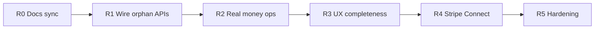

# Supper Collective — Completion roadmap

> **Purpose:** Ordered work to finish the site efficiently. Policy and product rules live in [`actors.md`](actors.md); this file is the execution queue.  
> **Last updated:** 2026-07-23  
> **Related:** [`actors.md`](actors.md), [`sitemap.md`](sitemap.md), Miro [Supper Collective flows](https://miro.com/app/board/uXjVHI1dVnI=/)

Phases 1–4 in `actors.md` delivered the actor model, role workspaces, meal lifecycle, interim platform Checkout, and ops cron. The remaining work is mostly **wiring orphaned APIs into UI**, **making money ops match Stripe**, then **Connect + polish** — not rebuilding those backends.

---

## How to use

1. Verify the live join→host path with [`test-join-to-host.md`](test-join-to-host.md) before starting R1.
2. Ship **in order R0 → R5**. Do not start Connect (R4) before refunds and ledger truth (R2).
3. Prefer **one vertical slice per PR** (API + UI + email/refund behavior together).
4. **Never rebuild** Phase 1–4 backends that already work — wire or extend them.
5. Treat [`actors.md`](actors.md) as policy; update checklist checkboxes there when a roadmap item lands.
6. Public onboarding stays **join-without-meal** (InviteForm + admin New Guests) unless you explicitly reverse the Jul 2026 deviation.

---

## Current state snapshot

| Area | Status | Notes |
|------|--------|--------|
| Identity + `members` / primary roles | **Done** | Guest / Member / Host / Chef |
| Join-without-meal + admin invitations | **Done** | Canonical public entry (Jul 2026) |
| Role workspaces (`/guest` `/member` `/host` `/chef` `/admin`) | **Done** | Shell + core flows |
| Meal CRUD, dual confirm, pairing, attendance → Member | **Done** | Host/chef APIs + cron archive |
| Platform Stripe Checkout + subsidy + fee toggle | **Done** | Interim; not Connect |
| T−14 / T−7 cron bookkeeping | **Done** | Ledger/email; refunds are DB-only |
| Disputes + cancel **APIs** | **Partial** | Backend exists; UI incomplete |
| Guest cancel / host cancel / price agree / remainder / dispute flag | **Gap** | Functions exist; no (or incomplete) UI callers |
| Real Stripe Refunds | **Gap** | Status flip only in DB |
| Admin Users + role override | **Gap** | Spec’d in actors; no tab |
| Member past-meals history | **Gap** | Spec’d; not in GuestMemberHome |
| File uploads (photos / CV) | **Gap** | URL text fields only |
| Meal-first public seat form | **Legacy** | `MealRequestForm` + `request-meal-seat` unused |
| Stripe Connect / card-on-file / real payouts | **Future** | R4 |
| `notify-waitlist` | **Stub** | Returns 501 |

---

## Efficiency rules

1. **Wire before invent** — if a function already exists under `netlify/functions/`, call it from the workspace UI.
2. **Money correctness before Connect** — ledger + Stripe refunds must match reality before destination charges.
3. **Docs follow code** — after each release, sync this file and stale bits of README / sitemap.
4. **One job per PR** — e.g. “guest cancel end-to-end including Stripe refund,” not “all host ops.”

---

## R0 — Sync truth (docs + inventory)

Refresh docs that still describe stubs or meal-first public calendar.

| Task | Detail |
|------|--------|
| Update [`README.md`](../README.md) | Payments are platform Checkout (not a stub); architecture table should match role routes |
| Update [`sitemap.md`](sitemap.md) | Calendar uses InviteForm / join-without-meal; list wired vs orphan functions accurately |
| Mark meal-first as optional | [`MealRequestForm.tsx`](../components/ui/MealRequestForm.tsx) + [`request-meal-seat.ts`](../netlify/functions/request-meal-seat.ts) = legacy until product re-enables |

**Exit criteria:** A new contributor reading README + sitemap would not think payments or onboarding are stubs/meal-first.

---

## R1 — Wire orphaned APIs (highest ROI)

Backend exists; add UI (and thin admin APIs where missing). Do these before new payment architecture.

| # | Action | API / work | UI surface | Key files |
|---|--------|------------|------------|-----------|
| 1.1 | Guest cancel + 14-day refund messaging | `guest-cancel-attendance` | Guest / Member home | [`GuestMemberHome.tsx`](../components/workspace/GuestMemberHome.tsx), [`guest-cancel-attendance.ts`](../netlify/functions/guest-cancel-attendance.ts) |
| 1.2 | Host agree meal price | `host-agree-meal-price` | Host workspace | [`HostWorkspace.tsx`](../components/workspace/HostWorkspace.tsx), [`host-agree-meal-price.ts`](../netlify/functions/host-agree-meal-price.ts) |
| 1.3 | Host edit meal | `host-meal-update` | Host workspace | [`host-meal-update.ts`](../netlify/functions/host-meal-update.ts) |
| 1.4 | Host request meal cancel | `host-request-meal-cancel` | Host workspace | [`host-request-meal-cancel.ts`](../netlify/functions/host-request-meal-cancel.ts) |
| 1.5 | Host trigger chef remainder | `host-trigger-chef-remainder` | Host workspace (post-meal) | [`host-trigger-chef-remainder.ts`](../netlify/functions/host-trigger-chef-remainder.ts) |
| 1.6 | Flag dispute | `meal-flag-dispute` | Host + Chef workspaces | [`meal-flag-dispute.ts`](../netlify/functions/meal-flag-dispute.ts), [`ChefWorkspace.tsx`](../components/workspace/ChefWorkspace.tsx) |
| 1.7 | Admin approve meal cancel | `admin-approve-meal-cancel` | Admin Meals / Disputes | [`app/admin/page.tsx`](../app/admin/page.tsx), [`admin-approve-meal-cancel.ts`](../netlify/functions/admin-approve-meal-cancel.ts) |
| 1.8 | Member past meals | Extend `get-member-summary` (or dedicated read) | Member home | [`get-member-summary`](../netlify/functions/), GuestMemberHome |
| 1.9 | Admin Users + primary-role override | New list + set-role functions | Admin **Users** tab | [`app/admin/page.tsx`](../app/admin/page.tsx), [`lib/auth.ts`](../netlify/functions/lib/auth.ts) `setPrimaryRole` |

**Suggested PR slices:** (1.1), (1.2+1.3), (1.4+1.7), (1.5), (1.6), (1.8), (1.9).

**Exit criteria:** Every row above has a working UI path; host can run a meal from price agree → cancel request / dispute / remainder without hitting the API manually.

---

## R2 — Harden interim money (before Connect)

Today cancel and T−7 auto-cancel flip `payments.status` / attendee rows without calling Stripe Refunds. Fix that while still on **platform Checkout**.

| # | Task | Detail | Key files |
|---|------|--------|-----------|
| 2.1 | Stripe Refunds on guest cancel | When ≥14 days and payment was charged, refund via Stripe then mark DB | [`guest-cancel-attendance.ts`](../netlify/functions/guest-cancel-attendance.ts), [`lib/stripe.ts`](../netlify/functions/lib/stripe.ts) |
| 2.2 | Stripe Refunds on T−7 auto-cancel | Cron must refund held/succeeded Checkout sessions, not only SQL | [`scheduled-milestone-check.ts`](../netlify/functions/scheduled-milestone-check.ts) |
| 2.3 | Stripe Refunds on admin meal cancel | Same for [`admin-approve-meal-cancel`](../netlify/functions/admin-approve-meal-cancel.ts) | Align with actors late-cancel / EC5 rules |
| 2.4 | Admin Funds clarity | Show pot vs ops `payments` / `payouts`; label what still needs **manual** off-platform action (chef ingredient/remainder until Connect) | [`app/admin/page.tsx`](../app/admin/page.tsx), [`admin-list-meals.ts`](../netlify/functions/admin-list-meals.ts) |
| 2.5 | Production payment checklist | Document: `STRIPE_SECRET_KEY`, webhook endpoint, **no** `ALLOW_DEMO_PAYMENTS` in prod | README or domain runbook |

**Exit criteria:** A paid guest who cancels 14+ days out receives a real Stripe refund; T−7 auto-cancel refunds appear in Stripe Dashboard; admin UI does not imply Connect escrow exists.

---

## R3 — Product UX completeness

| # | Task | Detail | Key files |
|---|------|--------|-----------|
| 3.1 | Past-meals + Member labeling | History list; verified Member badge/copy | GuestMemberHome, member summary |
| 3.2 | Host fill dashboard polish | Clear paid/10, subsidy CTA, T−14/T−7 status | HostWorkspace |
| 3.3 | File uploads | Kitchen/dining/CV/headshot via Blobs (or similar) instead of raw URL fields | Host/chef apply forms, storage helpers |
| 3.4 | `/chef/apply` route (optional) | Dedicated page; forms already live in guest/member home | New `app/chef/apply/`, RoleApplicationForms |
| 3.5 | Meal-first decision | **Retire** unused MealRequestForm path **or** re-enable on public calendar | Product call; keep join-without-meal until decided |

**Exit criteria:** Member sees past meals; host fill state is obvious; applications accept real uploads (or documented interim URL policy is intentional).

---

## R4 — Stripe Connect (actors “future”)

Only after R2. Replaces ops-ledger-only chef payouts with real money movement.

| # | Task | Detail |
|---|------|--------|
| 4.1 | Chef Connect onboarding | Persist `chefs.stripe_connect_id` |
| 4.2 | Destination charges / splits | Seat + fee on platform; chef share to connected account |
| 4.3 | Replace ops-only `recordPayout` | T−7 ingredient + post-meal remainder become real transfers (respect dispute pause) |
| 4.4 | Host card-on-file | Subsidy top-ups + late-cancel host penalties (actors future) |
| 4.5 | Escrow semantics | Align hold/release with actors payment rules |

**Key files:** [`lib/stripe.ts`](../netlify/functions/lib/stripe.ts), checkout/webhook handlers, chef dashboard, schema `stripe_connect_id`.

**Exit criteria:** Chef receives automatic ingredient + remainder via Connect; platform attendance fee retained; disputes pause remainder.

---

## R5 — Hardening & ops

| # | Task | Detail |
|---|------|--------|
| 5.1 | Critical-path smoke checks | Join → login → RSVP → profile → pay → attend → Member; host dual-confirm → approve → subsidy |
| 5.2 | Email / archive audit | T−14, payment, cancel, dispute, remainder templates vs cron/admin actions |
| 5.3 | `notify-waitlist` | Implement with Resend **or** delete the 501 stub and README references |
| 5.4 | Doc sync habit | After each release: this roadmap + actors checklist + sitemap |

**Exit criteria:** Happy-path and cancel/refund paths verified in staging; no known 501 stubs left undocumented.

---

## Explicitly deferred / out of roadmap scope

- Rewriting Phases 1–4 from scratch
- Miro board edits (see [`miro-diagram-7.md`](miro-diagram-7.md))
- Host picker from chef pool (actors G2 — after auto-pair scales)
- Per-guest attendance fee waivers (actors G1 — global toggle only)

---

## Progress checklist

Copy into PRs or track here:

- [ ] R0 — README + sitemap synced; meal-first marked legacy
- [ ] R1.1 — Guest cancel UI
- [ ] R1.2 — Host agree price UI
- [ ] R1.3 — Host meal edit UI
- [ ] R1.4 — Host cancel request UI
- [ ] R1.5 — Host chef remainder UI
- [ ] R1.6 — Dispute flag UI (host + chef)
- [ ] R1.7 — Admin approve meal cancel UI
- [ ] R1.8 — Member past meals
- [ ] R1.9 — Admin Users + role override
- [ ] R2.1–2.3 — Stripe Refunds on cancel paths
- [ ] R2.4–2.5 — Funds UI + prod checklist
- [ ] R3 — UX polish + uploads + meal-first decision
- [ ] R4 — Stripe Connect
- [ ] R5 — Smoke tests + stub cleanup

---

*Policy source of truth: [`actors.md`](actors.md). When implementing, point the agent at a specific R# item and say execute.*
