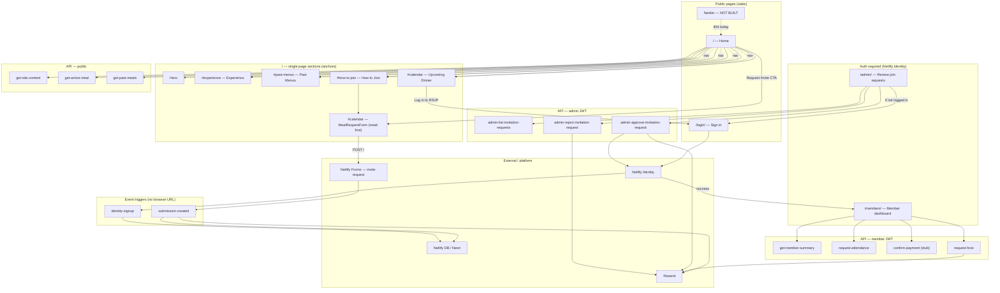
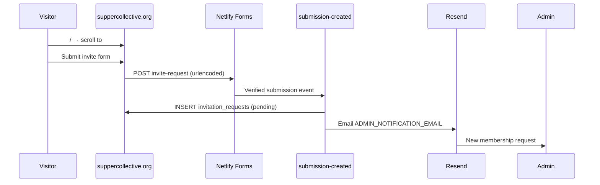
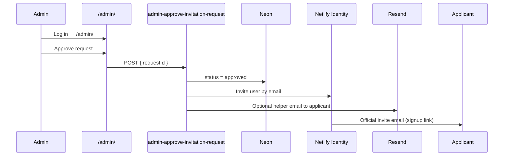
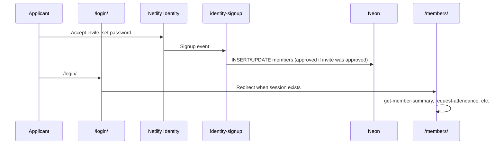
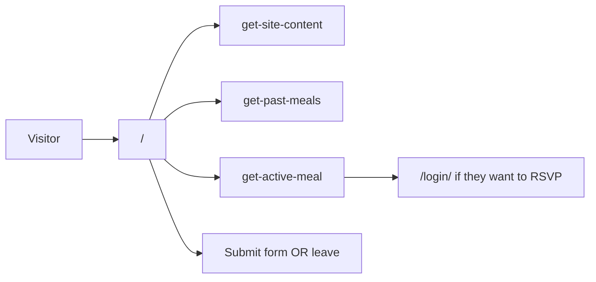

# Supper Collective — Site map & user flows

This document describes the **public routes**, **home-page sections**, **authenticated areas**, **Netlify Functions**, and **typical user journeys** as implemented in this repository.

Production site: [suppercollective.org](https://suppercollective.org) (legacy [sandiegosupperclub.com](https://sandiegosupperclub.com) redirects here).

---

## Page-level map

| Route | Built? | Access | Purpose |
| ----- | ------ | ------ | ------- |
| `/` | Yes | Public | Marketing site + meal seat request on calendar |
| `/login/` | Yes | Public | Netlify Identity sign-in |
| `/guest/` | Yes | Identity | Guest home — meal RSVP, profile, host/chef apply |
| `/member/` | Yes | Identity | Member home (same workspace; verified label) |
| `/host/` | Yes | Identity (host) | Host workspace — meal CRUD, attendees, dual confirm |
| `/chef/` | Yes | Identity (chef) | Chef workspace — pricing, dashboard |
| `/members/` | Yes | Identity | Redirects to role home (`/guest/` or `/member/` etc.) |
| `/admin/` | Yes | Admins (Identity) | Tabs: Applications, Meals, Funds, Disputes, Invitations (legacy) |
| `/lander` | **No** | — | Not in codebase; live URL returns 404 unless you add a page or redirect |

The marketing entry point is **`/`**, not `/lander`.

---

## Site map (pages & sections)



---

## Home page (`/`) — sections & anchors

All marketing content lives on one page. Navigation uses hash links:

```
/  (Home)
├── Hero
├── #experience      Experience          (components/sections/Experience.tsx)
├── #past-menus      Past Menus          (components/sections/PastMenus.tsx)
├── #how-to-join     How to Join         (components/sections/Membership.tsx)
├── #request-invite  Invite form         (components/ui/InviteForm.tsx)
└── #calendar        Upcoming dinner     (components/sections/UpcomingDinner.tsx)
```

**Global chrome** (every page): `Navigation` (anchors + “Request Invite”) and `ContactFooter` (Instagram, mailto).

**Source:** `app/page.tsx`, `components/nav/Navigation.tsx`

---

## Netlify Functions (not browser pages)

Invoked at `/.netlify/functions/<name>` (or via `netlifyFunctionUrl()` in the app).

### Public (no login)

| Function | Called from |
| -------- | ----------- |
| `get-site-content` | `SiteContentProvider` (layout) |
| `get-active-meal` | `UpcomingDinner` |
| `get-past-meals` | `PastMenus` |

### Event triggers

| Function | When it runs |
| -------- | ------------ |
| `submission-created` | After Netlify Forms verifies an `invite-request` submission → DB row + optional Resend email to admin |
| `identity-signup` | When a user completes Netlify Identity signup (invite accepted) → `members` row |

### Member (Identity JWT)

| Function | Called from |
| -------- | ----------- |
| `get-member-summary` | `/members/` — returns `primaryRole`, `profileComplete`, host/chef approval flags |
| `request-attendance` | `/members/` |
| `confirm-payment` | `/members/` (stub — no real payment provider) |
| `request-host` | `/members/` → requires full profile + photos + equipment-for-10 before submit; Resend email to admin |
| `chef-apply` | `/members/` → chef application (CV + references required); Resend email to admin |
| `host-list-attendees` | host workspace — waitlist for a dinner the host owns |
| `host-review-attendee` | host workspace — approve/reject a waitlisted attendee (blocked until T−30 dual confirm) |

### Admin (Identity JWT + admin role)

| Function | Called from |
| -------- | ----------- |
| `admin-list-invitation-requests` | `/admin/` → Invitations tab (legacy) |
| `admin-approve-invitation-request` | `/admin/` → Identity invite + Resend helper email |
| `admin-reject-invitation-request` | `/admin/` → optional Resend email to applicant |
| `admin-list-applications` | `/admin/` → Applications tab (pending host + chef applications) |
| `admin-review-host` | `/admin/` → approve/reject host; sets `primary_role = host`; Resend email |
| `admin-review-chef` | `/admin/` → approve/reject chef; sets `primary_role = chef`; Resend email |

### Other

| Function | Status |
| -------- | ------ |
| `notify-waitlist` | Stub (returns 501) |
| `web3forms-invite-webhook` | Legacy; primary path is Netlify Forms |

---

## Typical user flows

### 1. Visitor requests to join



**Code:** `components/ui/InviteForm.tsx` → `netlify/functions/submission-created.ts`

---

### 2. Admin approves a request



**Code:** `app/admin/page.tsx` → `netlify/functions/admin-approve-invitation-request.ts`

---

### 3. Member joins and uses the dashboard



**Code:** `app/login/page.tsx`, `app/members/page.tsx`, `netlify/functions/identity-signup.ts`

---

### 4. Public visitor browses only



---

## Navigation between pages

| From | To | How |
| ---- | -- | --- |
| Any page | `/` | Logo “Supper Collective” |
| `/` | `#experience`, `#past-menus`, `#how-to-join`, `#calendar` | Nav links |
| `/` | `#request-invite` | “Request Invite” button |
| `/` → Upcoming Dinner | `/login/` | “Log in” when meal is live |
| Unauthenticated | `/admin/` or `/members/` | Redirect to `/login/` |
| `/login/` | `/members/` | After successful Identity login |
| `/admin/`, `/members/` | `/` | Header link |

---

## Related docs

- [README.md](../README.md) — setup, env vars, Resend, Netlify DB
- [netlify/db/README.md](../netlify/db/README.md) — schema and seeds
