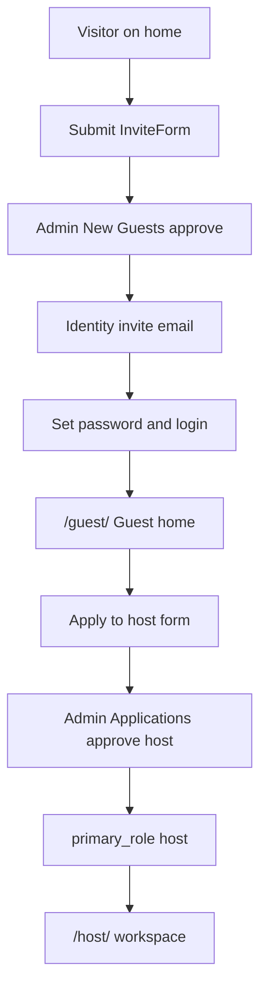

# Manual test: Join → Host

> **Purpose:** Click-through checklist for the path from first public join to an approved Host workspace — as the app works **today**.  
> **Last updated:** 2026-07-23  
> **Policy:** [`actors.md`](actors.md) (G3: Guest may apply to host without attending a meal)  
> **Product roadmap:** [`roadmap.md`](roadmap.md)

Use this before implementing roadmap R1+. Mark each step **Pass / Fail / Blocked**. Stop after step 7 — do not continue into meal CRUD until you green-light the next slice.

---

## Prerequisites

| Need | Check |
|------|--------|
| Site URL | Staging or production (e.g. [suppercollective.org](https://suppercollective.org)) |
| Admin account | Email on `admins` allowlist; can open `/admin/` |
| Applicant email | Fresh inbox you control (not already an Identity user) |
| Two sessions | Admin in one browser; applicant in another (or incognito) |
| Email | Netlify Identity invites + Resend configured for decision/admin notify emails |

**Not required for this path:** a live meal, Stripe keys, or prior attendance (Guest → Member is a separate slice).

---

## Results log

| Field | Value |
|-------|--------|
| Environment / URL | |
| Date | |
| Tester | |
| Applicant email | |
| Overall | Pass / Fail / Blocked |

---

## Steps

### 1. Visitor submits join request

| | |
|--|--|
| **Actor** | Visitor (logged out) |
| **Action** | Open `/` → **How to Join** → fill invite form: name, email, birth year (21+), referred by, why → submit |
| **Expect** | Success copy (“Thank you…”); no login yet |
| **Also check** | Admin session → `/admin/` → **New Guests** shows the request as pending |

- [ ] Pass
- [ ] Fail
- [ ] Blocked — notes:

---

### 2. Admin approves invitation

| | |
|--|--|
| **Actor** | Admin |
| **Action** | `/admin/` → **New Guests** → Approve the applicant |
| **Expect** | Request status updates; Netlify Identity **invite email** arrives at applicant inbox |

- [ ] Pass
- [ ] Fail
- [ ] Blocked — notes:

---

### 3. Applicant accepts invite and sets password

| | |
|--|--|
| **Actor** | Applicant |
| **Action** | Open Identity invite link → set password → complete signup |
| **Expect** | Can sign in at `/login/` with that email/password |

- [ ] Pass
- [ ] Fail
- [ ] Blocked — notes:

---

### 4. Applicant lands on Guest home

| | |
|--|--|
| **Actor** | Applicant (signed in) |
| **Action** | After login, follow redirect (often `/members/` → role home) or open `/guest/` |
| **Expect** | Page titled **Guest home**; shell nav for guest; sections for live meal / RSVP (if any) and **Apply to host** / **Apply to cook** |
| **Also check** | Not yet forced into `/host/` |

- [ ] Pass
- [ ] Fail
- [ ] Blocked — notes:

---

### 5. Applicant submits host application

| | |
|--|--|
| **Actor** | Applicant (Guest) |
| **Action** | On Guest home → **Apply to host**. Fill required fields and submit. |

**Required today:**

- Mobile phone  
- Full address  
- ZIP  
- Kitchen photo **URL**  
- Dining room photo **URL**  
- Check all three: cutlery / glassware / crockery for 10  

Optional: allergies, message to admins.

| **Expect** | Submit succeeds; button shows **Host application pending review** (or equivalent pending state) |
| **Also check** | Admin → **Applications** shows this host as **pending** |

- [ ] Pass
- [ ] Fail
- [ ] Blocked — notes:

---

### 6. Admin approves host application

| | |
|--|--|
| **Actor** | Admin |
| **Action** | `/admin/` → **Applications** → find pending host → Approve |
| **Expect** | Application approved; applicant gets host decision email (if Resend configured); member `primary_role` becomes **host** |

- [ ] Pass
- [ ] Fail
- [ ] Blocked — notes:

---

### 7. Applicant opens Host workspace — **STOP LINE**

| | |
|--|--|
| **Actor** | Applicant |
| **Action** | Sign out/in or refresh; open `/host/` (or Host link in nav) |
| **Expect** | Host workspace loads (meal create / ops UI), not Guest home as default role |

**Stop here.** Do not test meal draft, dual confirm, attendees, or payments in this runbook.

- [ ] Pass
- [ ] Fail
- [ ] Blocked — notes:

---

## Known gaps (not failures for this path)

These are expected until later roadmap work — do **not** mark Fail solely for these:

| Gap | Notes |
|-----|--------|
| Photo / CV as URL fields | No file upload yet (roadmap R3) |
| Meal-first public seat form unused | Join is InviteForm + New Guests (intentional Jul 2026) |
| No meal / pay / Member step | Host apply does not require attendance (actors G3) |
| Host meal CRUD / cancel / dispute UI incomplete | Out of scope for this runbook (roadmap R1) |

---

## Next test slices (when you green-light)

1. **Guest → meal RSVP → Member** — request seat, host approve, profile, pay, mark attended  
2. **Host → first meal** — draft, chef price, dual confirm, public listing  
3. Roadmap **R1** wiring only after those paths match what you expect

---

*If a step Fails, note the route, approximate time, and any on-screen error before changing code.*
